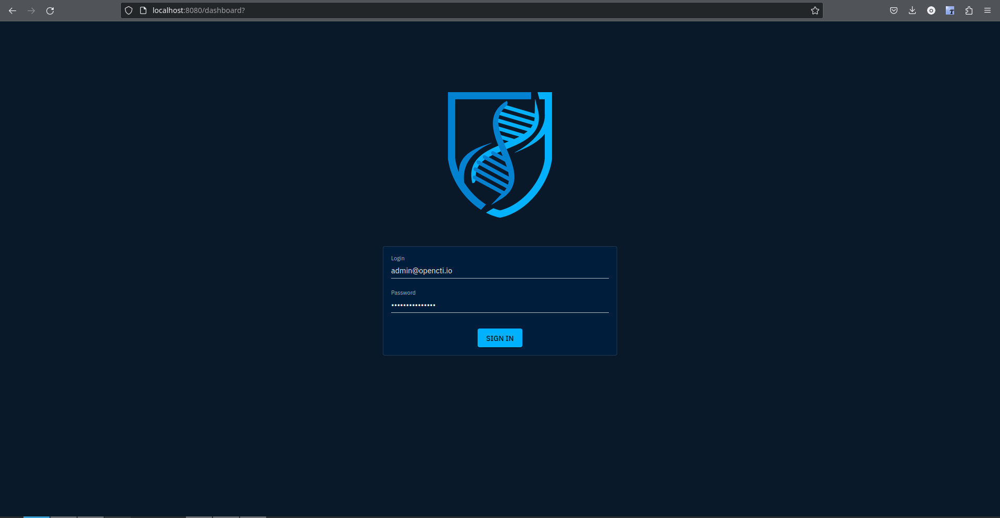
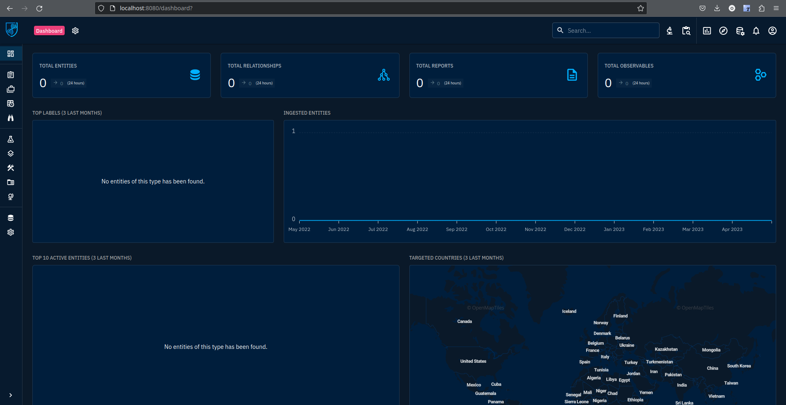

# Развертывание Threat intelligence Platform OpenCTI
Александр Смирнов

## Цель работы

1.  Освоить базовые подходы процессов Threat Intelligence

2.  Освоить современные инструменты развертывания контейнеризованных
    приложений

3.  Получить навыки поиска информации об угрозах ИБ

## Ход выполнения практической работы

Для разворачивания системы threat intelligence OpenCTI была использована
система контейнеризации приложений Docker.

### Шаг 1 - Предварительная конфигурация

#### 1.Для работы ElasticSearch требуется увеличить размер виртуальной памяти системы:

``` bash
    sudo sysctl -w vm.max_map_count=262144
```

### Шаг 2 - создание файла конфигурации

Был создан файл окружения .env со следующими параметрами:

    OPENCTI_ADMIN_EMAIL - логин администратора
    OPENCTI_ADMIN_PASSWORD - пароль администратора
    OPENCTI_ADMIN_TOKEN - токен администратора (UUID4) для API OpenCTI
    OPENCTI_BASE_URL - доменное имя OpenCTI
    MINIO_ROOT_USER - логин от minio
    MINIO_ROOT_PASSWORD - пароль от minio
    RABBITMQ_DEFAULT_USER - логин от rabbitmq
    RABBITMQ_DEFAULT_PASS - пароль от rabbitmq
    SMTP_HOSTNAME - хостнейм SMTP
    ELASTIC_MEMORY_SIZE - размер памяти, используемый ElasticSearch

#### 3.Создание Docker-compose.yml

Был создан файл Docker-compose.yml, разворачивающий СУБД Redis,
объектное хранилище minio, инстанс ElasticSearch, брокер сообщений
RabbitMQ и систему threat intelligence OpenCTI с коннекторами, вложенный
в репозитории.

``` bash
docker-compose up -d
```

    lab4_redis_1 is up-to-date
    lab4_minio_1 is up-to-date
    lab4_elasticsearch_1 is up-to-date
    lab4_rabbitmq_1 is up-to-date
    lab4_opencti_1 is up-to-date
    lab4_connector-export-file-txt_1 is up-to-date
    lab4_connector-export-file-stix_1 is up-to-date
    lab4_connector-export-file-csv_1 is up-to-date
    lab4_worker_1 is up-to-date
    lab4_worker_2 is up-to-date
    lab4_worker_3 is up-to-date
    lab4_connector-import-document_1 is up-to-date
    lab4_connector-import-file-stix_1 is up-to-date

#### 4. Использование системы threat intelligence OpenCTI

1.После перехода на веб-ресурс OpenCTI пользователя встречает поле
авторизации:



2.Входим по указанным в конфигурации окружения логину и паролю.

3.После входа появляется веб-интерфейс:



4.Импортируем содержимое файла hosts.txt как индикаторы, используя API
Opencti:

``` python
import pycti
from stix2 import TLP_GREEN
from datetime import datetime
date = datetime.today().strftime("%Y-%m-%dT%H:%M:%SZ")

api_url = 'http://localhost:8080'
api_token = 'cedd95c3-744d-43ef-a300-2bc54a99baad'
client = pycti.OpenCTIApiClient(api_url, api_token)

TLP_GREEN_CTI = client.marking_definition.read(id=TLP_GREEN["id"])
with open('hosts.txt', 'r') as f:
    domains = f.read().splitlines()
k = 1
for domain in domains:
    indicator = client.indicator.create(
    name="Malicious domain {}".format(k),
    description="MPVS hosts",
    pattern_type="stix",
    label="mpvs hosts",
    pattern="[domain-name:value = '{}']".format(domain),
    x_opencti_main_observable_type="IPv4-Addr",
    valid_from=date,
    update=True,
    score=75,
    markingDefinitions=[TLP_GREEN_CTI["id"]],
    )
    print("Создан индикатор:", indicator["id"])
    k += 1
```

В результате был получен список индикаторов нежелательных доменов с
тегом mpvs hosts:


После импорта индикаторов стоит преобразовать их в Observables для
упрощения анализа.

5.Импортируем трафик, полученный в ходе выполнения ЛР№2 (файл dns.log) в
репозитории:


6.Добавим для всех доменов, которые оказались без тега, тег traffic:


7.В результате главный экран стал выглядеть следующим образом:


8.Проверим, есть ли в полученном трафике (вкладка Report) домены с тегом
нежелательного домена:


Пользователем было посещено 40 нежелательных доменов.

## Оценка результата

С помощью платформы OpenCTI удалось проанализировать трафик на предмет
перехода по нежелательным доменам.

## Выводы

Таким образом, были изучены возможности работы с платформой threat
intelligence OpenCTI.Я смог кстати в итоге поднять базу на своей
стороне, надо значит будет разобраться полноценно во всём и мысли
синхронизировать
